# Diagramas de Fluxo - Arquitetura V3.0

**Data:** 16 de outubro de 2025  
**Versão:** 3.0.0  

---

## 🔄 FLUXO PRINCIPAL DE EXECUÇÃO

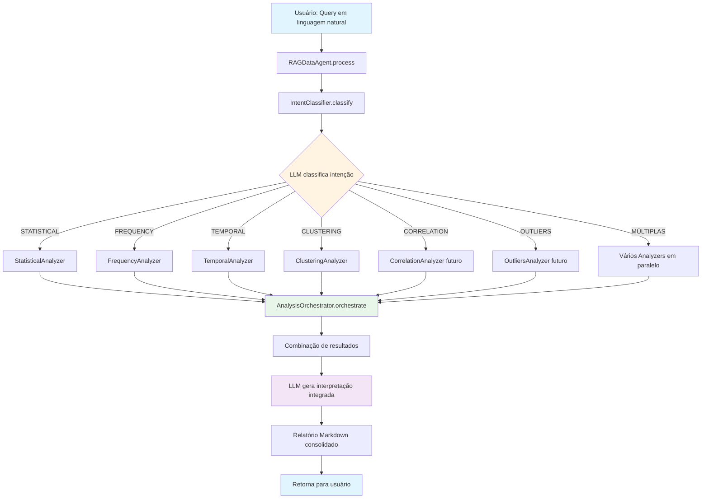

---

## 🎯 FLUXO DE CLASSIFICAÇÃO DE INTENÇÃO

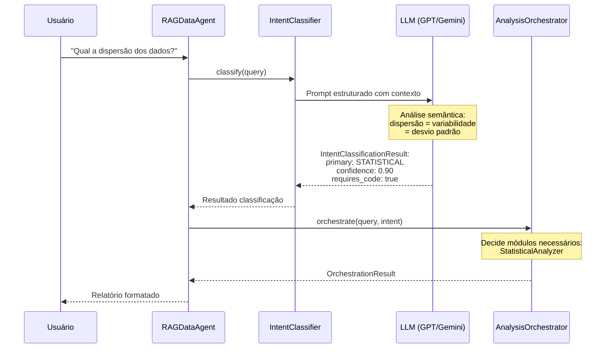

---

## 🔧 FLUXO DE ORQUESTRAÇÃO DE MÓDULOS

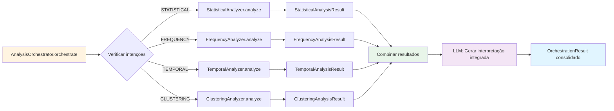

---

## 📊 FLUXO DE ANÁLISE ESTATÍSTICA DETALHADO

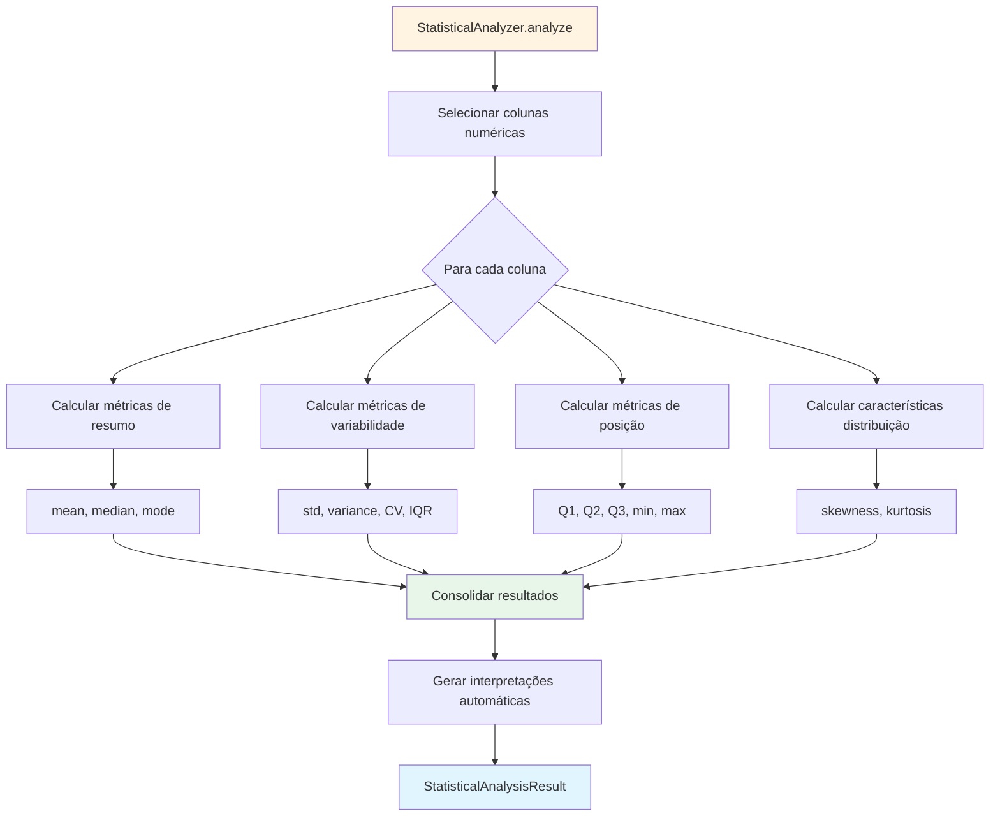

---

## 🔍 FLUXO DE ANÁLISE DE CLUSTERING

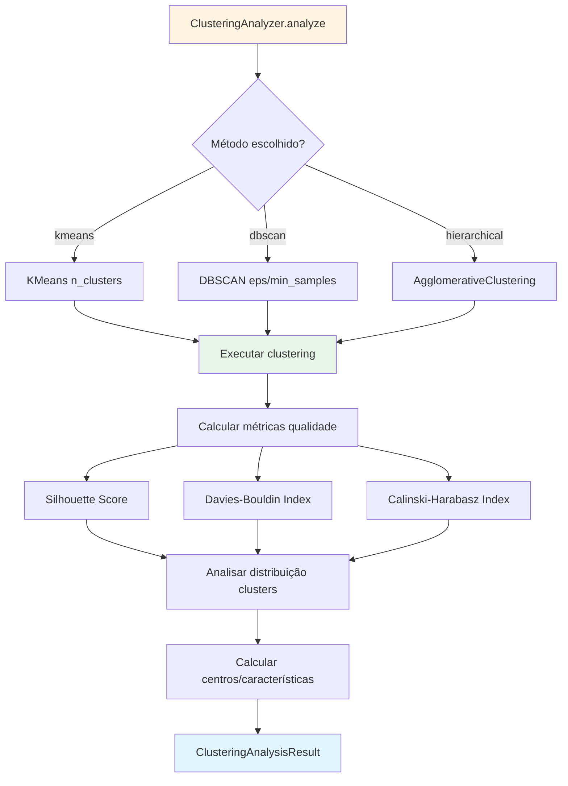

---

## 🌐 ARQUITETURA MODULAR COMPLETA

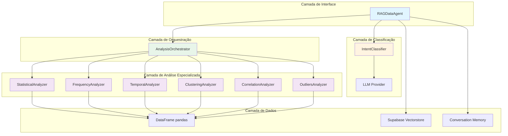

---

## 🔄 COMPARAÇÃO FLUXO V2.0 vs V3.0

### V2.0 (Hard-coded)

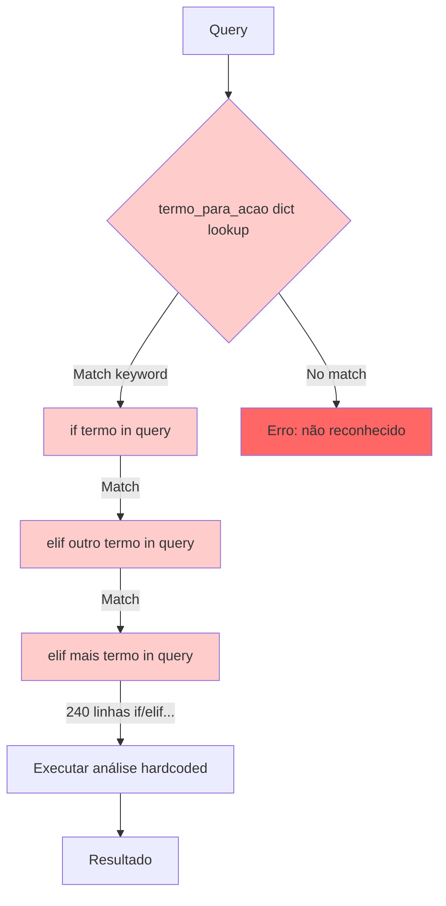

**Problemas:**
- ❌ 400+ linhas de if/elif
- ❌ Lista fixa de keywords
- ❌ Não reconhece sinônimos
- ❌ Difícil adicionar novos tipos
- ❌ Queries mistas processam só 1 parte

---

### V3.0 (LLM-driven)

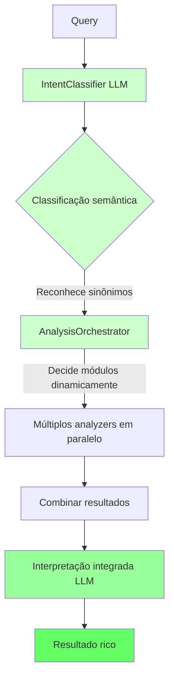

**Vantagens:**
- ✅ Zero hard-coding
- ✅ Reconhece sinônimos automaticamente
- ✅ Suporta queries mistas
- ✅ Extensível sem modificar código
- ✅ Interpretação contextual inteligente

---

## 📈 FLUXO DE ADIÇÃO DE NOVO MÓDULO

```mermaid
graph LR
    A[Identificar necessidade] --> B[Criar novo Analyzer]
    B --> C[Implementar método analyze]
    C --> D[Criar dataclass Result]
    D --> E[Registrar no Orchestrator]
    E --> F[Adicionar Intent se necessário]
    F --> G[Criar testes unitários]
    G --> H[Documentar uso]
    
    H --> I[Módulo disponível automaticamente!]
    
    style A fill:#fff4e1
    style E fill:#e8f5e9
    style I fill:#66ff66
```

**Tempo estimado:** 2-4 horas (vs 2-3 dias em V2.0)

---

## 🧪 FLUXO DE TESTE E VALIDAÇÃO

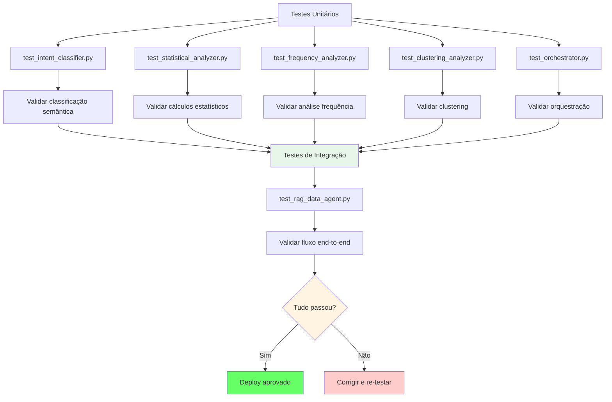

---

## 🔐 FLUXO DE SEGURANÇA (Futuro)

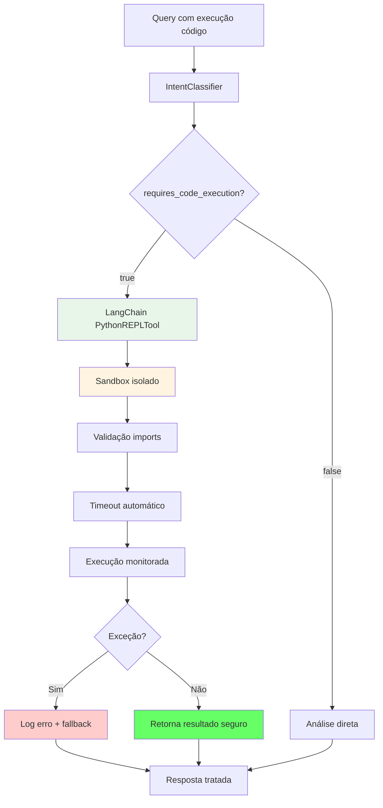

**Status:** Planejado para Sprint 2

---

## 📚 LEGENDA DE CORES

- 🔵 **Azul claro** (#e1f5ff): Entrada/Saída do usuário
- 🟡 **Amarelo claro** (#fff4e1): Decisão/Classificação (LLM)
- 🟢 **Verde claro** (#e8f5e9): Processamento/Orquestração
- 🟣 **Roxo claro** (#f3e5f5): Módulos especializados
- 🟢 **Verde forte** (#66ff66): Sucesso/Aprovação
- 🔴 **Vermelho** (#ffcccc): Erro/Problema

---

**Diagramas criados por:** EDA AI Minds Team  
**Última atualização:** 16 de outubro de 2025  
**Ferramenta:** Mermaid.js  
**Renderização:** GitHub Markdown / VSCode Markdown Preview
