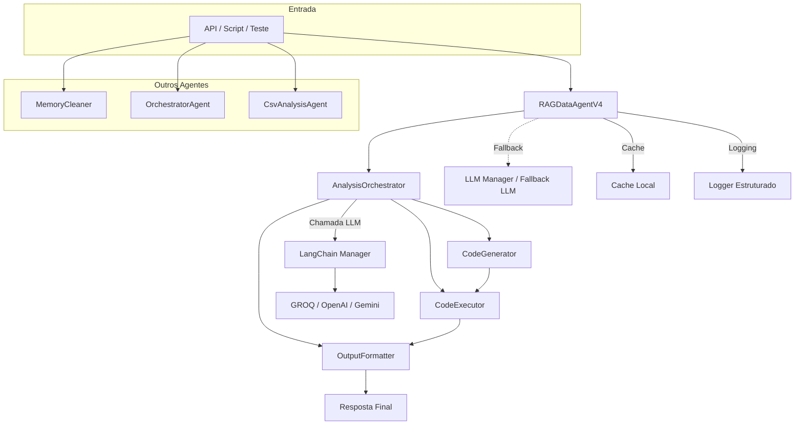

# Diagrama do Pipeline Modular Multiagente (Mermaid)

> **Legenda:**
> - O fluxo principal utiliza o `RAGDataAgentV4` e o orquestrador para análise, geração, execução e formatação de código dinâmico.
> - Outros agentes especializados continuam disponíveis e podem ser acionados conforme o contexto multiagente.
> - Integração com múltiplos LLMs via LangChain Manager.
