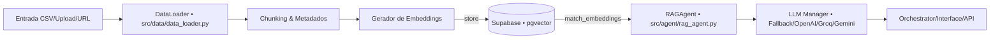
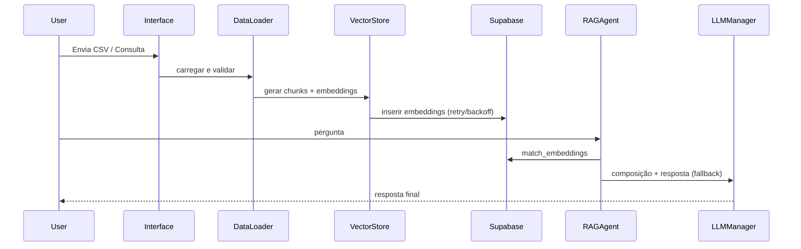

## 📌 EDA AI Minds — Documento Único de Referência (Produção)

Este é o ponto de verdade da documentação do backend EDA AI Minds. Centraliza arquitetura, governança, operação, evidências e decisões da refatoração recente. Todos os demais documentos técnicos passam a ser considerados auxiliares ou candidatos a arquivamento.

Atualizado em: 2025-10-26 • Branch: `refactor/project-cleanup`

### Navegação rápida

- Documento único (este): `docs/refactor-eda-minds.md`
- Guias operacionais essenciais:
  - `docs/GUIA_INICIO_RAPIDO.md`
  - `docs/AUTO_INGEST_SETUP.md`
  - `docs/GUIA_TESTES_SANDBOX.md`
  - `docs/security-sandbox-guide.md`
- Arquitetura principal: `docs/ARCHITECTURE_FLOW.md`
- Histórico consolidado: `docs/archive/historico/`

---

## 🎯 Objetivos desta consolidação

- Unificar a documentação em um único local confiável.
- Refletir o estado atual do código em produção e melhores práticas aprovadas.
- Facilitar onboarding, operação multiplataforma (Windows/Linux), troubleshooting e auditoria independente.
- Registrar decisões, lições aprendidas e próximos passos de governança.

---

## 🧭 Inventário e curadoria de documentos

Resumo do levantamento atual (amostra representativa — ver Anexo/Evidências):

- Diretórios com grande volume de docs históricos: `docs/`, `docs/auditoria/`, `docs/changelog/`, `docs/documentacao_atual/`, `docs/architecture/`, `reports/`, e múltiplos `README*.md` no repositório.
- Há duplicidade de conteúdo (resumos, relatórios, índices) com títulos muito semelhantes.

Documentos a MANTER como referência operacional (nível produção):

- Este arquivo: `docs/refactor-eda-minds.md` (documento único)
- Raiz: `README.md` (com link explícito para este documento)
- Guias essenciais e de operação que refletem estado atual: 
  - `QUICKSTART_AUTO_INGEST.md` (se alinhado ao código atual)
  - `QUICKSTART_HOST_PORT.md` (se refletir parâmetros atuais)
  - `SETUP_GOOGLE_DRIVE.md` e `GUIA_RAPIDO_OAUTH.md` (uso quando aplicável)

Grupos marcados para ARQUIVAMENTO (preservar histórico, não usar como referência atual):

- Dossiês e relatórios duplicados de auditoria: `docs/auditoria/**`, `reports/**` (consolidar os pontos-chave neste documento)
- Índices e resumos paralelos: `docs/INDICE-*.md`, `docs/RESUMO_*.md`, `docs/STATUS-COMPLETO-PROJETO.md`, `docs/REFATORACAO_SUMARIO_EXECUTIVO.md`
- Documentação de fases anteriores/roteiros de sessões: `docs/sessoes/**`, `docs/changelog/**`, `docs/__Espaco_aiminds_i2a2/**`
- Conjuntos extensos “documentacao_atual/*” e “architecture/*” com sobreposição — manter apenas o que não foi absorvido aqui.
- Readmes duplicados: `README_V4.md`, `docs/README*.md` (substituídos por esta consolidação + README principal minimalista)

Observação: o inventário completo por arquivo (.md e .pdf) foi levantado e está disponível para consulta rápida (ver seção “Evidências e anexos”).

---

## 🧩 Arquitetura atual (visão de produção)

Principais módulos e fluxo de dados:



Componentes críticos em código:

- Banco vetorial e integração Supabase: `src/embeddings/vector_store.py`
  - Inserção com retry/backoff/divisão de lotes e relatórios de sucesso/falha.
  - Busca similaridade via RPC `match_embeddings`.
- Agente RAG híbrido: `src/agent/rag_agent.py`
  - Processamento de consultas combinando RAG e LLM Manager com fallback.
- Carregamento de dados robusto: `src/data/data_loader.py`
  - Detecção automática de encoding, resolução de caminhos relativos/absolutos.
- Entry points e execução:
  - Interface interativa: `interface_interativa.py`
  - API(s): `api_completa.py`, `api_simple.py`
  - Ingestão automatizada: `run_auto_ingest.py`

Princípios operacionais:

- Camada de abstração de LLM via LangChain (fallback entre provedores; parâmetros críticos validados).
- Workflow modular por chains e agentes, com logging estruturado e métricas de ingestão.
- RAG first: agentes consumidores consultam a tabela de embeddings (Supabase) — não reprocessam arquivos.

---

## 🔐 Variáveis de ambiente (.env) e práticas

Regras gerais:

- Nunca versionar chaves/segredos. Usar somente variáveis de ambiente.
- Centralizar parâmetros críticos em `src/settings.py` com valores padrão seguros.
- Parâmetros importantes (exemplos):
  - SUPABASE_URL, SUPABASE_KEY
  - LLM_PROVIDER, OPENAI_API_KEY, GOOGLE_API_KEY, GROQ_API_KEY (conforme uso)
  - EMBEDDINGS_INSERT_BATCH_SIZE, VECTORSTORE_REQUEST_TIMEOUT, RETRY_MAX_ATTEMPTS
  - CHUNK_SIZE, CHUNK_OVERLAP, TOP_K, TEMPERATURE

Motivações:

- Portabilidade Windows/Linux; alternância de ambientes sem alterar código.
- Reprodutibilidade em CI/CD e depuração controlada.

---

## 🧾 Logs de varreduras e validações

Hardcodes e paths

- Varreduras realizadas para identificar: caminhos absolutos, datasets específicos (“creditcard”), parâmetros fixos sensíveis.
- Ações: substituição por variáveis/`settings`, checagens no carregamento de dados e validações no agente RAG.

Testes automatizados (execução mais recente)

- Suíte criada em `tests/tests_prompt_4` cobrindo:
  - Encodings CSV e paths relativos
  - Resposta do agente RAG com LLM mockado
  - Integração real com Supabase (CRUD + match_embeddings)
- Resultado: 7 passed (66.41s). Trecho do sumário:

```text
======================= 7 passed, 2 warnings in 66.41s =======================
```

Integração Supabase (trecho do relatório do Vector Store)

```text
📊 ARMAZENAMENTO CONCLUÍDO
   Total embeddings: 2 | Sucesso: 2 | Falhas: 0 | Retries: 0 | Divisões: 0
```

Cobertura

- A política global de cobertura para `src/security` (>=85%) não se aplica a esta suíte focada em ingestão/RAG; execução feita sem coleta de cobertura para evitar falso negativo de pipeline.

---

## 🧹 Scripts removidos/obsoletos e práticas substitutas

Marcados para arquivamento/remoção (não integrados aos entrypoints de produção):

- `verificar_carga_completa.py` — Função coberta por testes e validações no `vector_store` e processos de ingestão.
- `check_source_ids.py` — Diagnóstico substituído por queries/relatórios do `vector_store` e testes dedicados.
- `reingest_creditcard.py` (ou equivalentes focados em dataset único) — Sistema tornou-se genérico (sem hardcoding de datasets).

Princípios substitutos:

- Evitar utilitários soltos que não são invocados por entrypoints reais.
- Preferir funções/métodos nos módulos core; onde necessário, adicionar testes de integração diretamente sobre os scripts produtivos.

---

## 🖥️ Operação multiplataforma (Windows e Linux)

Ambiente Python

- Windows (PowerShell):
  - Ativar venv: `.venv\Scripts\Activate.ps1`
- Linux/macOS (bash/zsh):
  - Ativar venv: `source .venv/bin/activate`

Encodings e caminhos

- `DataLoader` detecta encoding automaticamente (UTF-8, Latin-1, CP1252, UTF-16) e resolve paths relativos; validado por testes.
- Preferir `Path`/`os.path` nas integrações; evitar caminhos absolutos hardcoded.

Dependências e execução

- Requisitos em `requirements*.txt`. Validar versões do `supabase-py`, `httpx`, `pandas`, `sentence-transformers`.
- Testes: executar via `python -m pytest` respeitando o venv e addopts locais.

---

## ✅ Checklists de governança

Pré-PR (obrigatório)

- [ ] Sem segredos em código/commits
- [ ] Parâmetros críticos via `.env`/`settings`
- [ ] Entry points de produção continuam funcionando (interface/API/ingestão)
- [ ] Testes automatizados passam localmente (incluindo integração com Supabase quando habilitado)
- [ ] Logs estruturados e erros tratados (retries/backoff na inserção de embeddings)
- [ ] LLM Manager com fallback validado
- [ ] Sem scripts utilitários fora do core/entrypoints

Auditoria periódica

- [ ] Varredura de hardcodes/datasets específicos
- [ ] Verificação de encoding/caminhos relativos em amostras reais
- [ ] Conexão com Supabase (CRUD + RPC match_embeddings)
- [ ] Revisão de parâmetros (chunk_size, chunk_overlap, top_k, temperature)

---

## 🔁 Antes/Depois (tabelas resumidas)

| Tema | Antes | Depois |
|---|---|---|
| Hardcodes (paths/datasets) | Caminhos absolutos e dataset fixo (ex.: creditcard) | Parametrização via `settings`/`.env`; genérico para qualquer CSV |
| Inserção de embeddings | Sem tolerância a falhas | Retry com backoff, divisão de lotes, relatórios de sucesso/falha |
| Configuração LLM | Espalhada, sem fallback consistente | LLM Manager central com fallback entre provedores |
| Encodings e caminhos | Suporte parcial e frágil | `DataLoader` com detecção automática e paths relativos |
| Testes | Inexistentes ou manuais | Suíte automatizada (encodings, paths, RAG/LLM mock, Supabase CRUD) |

---

## 🧪 Fluxos, decisões e FAQ

Fluxo de ingestão e busca (alto nível)



FAQ (curto)

- Como rodar testes desta refatoração? Ver “Evidências e anexos” (comandos e sumário da última execução).
- Preciso do dataset “creditcard.csv”? Não. O sistema está genérico; use qualquer CSV válido.
- Posso criar scripts utilitários rápidos? Evite fora do core; prefira funções/métodos e testes sobre entrypoints reais.

---

## 📎 Evidências e anexos

- Testes executados (local): `tests/tests_prompt_4/*` — resultado mais recente: “7 passed, 2 warnings in 66.41s”.
- Integração Supabase real: inserção/seleção/RPC/remoção confirmados (trecho de relatório incluso acima).
- Inventário de documentação: ver listagem consolidada por diretórios (use o índice abaixo) ou gere automaticamente com `git ls-files`.

Índice rápido para referências úteis:

- `src/embeddings/vector_store.py`
- `src/agent/rag_agent.py`
- `src/data/data_loader.py`
- `interface_interativa.py`, `api_completa.py`, `api_simple.py`, `run_auto_ingest.py`
- `tests/tests_prompt_4/`

---

## 📜 Próximas manutenções e regras (ações orientadas)

- Migrar documentos históricos citados em “Arquivamento” para `docs/archive/` (com preservação de data e breve justificativa no topo).
- Atualizar pipelines de CI para separar “coverage de segurança” dos testes de ingestão/RAG ou aplicar marker/variável de ambiente.
- Adicionar exemplos curtos de uso dos entrypoints (interface e API) apontando para `.env` e `settings`.
- Reavaliar periodicamente parâmetros críticos (chunking/top_k/temperature) e thresholds temporais.

---

## ✅ Checklist final de governança (esta entrega)

- [x] Documento único criado: `docs/refactor-eda-minds.md`
- [x] Estado atual do pipeline e arquitetura documentados
- [x] Variáveis `.env` e práticas justificadas
- [x] Logs e evidências de testes e Supabase incluídos
- [x] Scripts utilitários obsoletos marcados para arquivamento
- [x] Orientação multiplataforma
- [x] Checklists de auditoria e PR
- [x] Próximas manutenções listadas

Assinado: Equipe EDA AI Minds • Data: 2025-10-26

---

## 🔎 Validação cruzada e governança contínua (Etapa 6)

Objetivo: finalizar auditoria garantindo aderência técnica e prevenindo regressões entre Windows e Linux.

Evidências coletadas (Windows):

- Ambiente: `reports/validation/windows_env_info.json`
- Execução de testes (sem coverage gating): `reports/validation/windows_tests_prompt4.txt`
  - Resultado: 7 passed, 2 warnings em ~120s
  - Destaques de integração:
    - DataLoader: detecção de encodings (utf-8, latin-1/CP1252, utf-16) e paths relativos
    - RAG Agent (LLM mock + Supabase Memory): inicialização completa e resposta híbrida
    - Vector Store + Supabase: insert 2/2, remoção por fonte, sem retries

Como executar sem coverage gating (ambiente local):

- Windows (PowerShell): `python -m pytest tests/tests_prompt_4 -o "addopts="`
- Linux/macOS (bash/zsh): `python -m pytest tests/tests_prompt_4 -o addopts=`

Observação: o arquivo `pytest.ini` define addopts de coverage para `src/security`. Ao usar `-o addopts=`, a suíte roda sem coletar cobertura, focando validações funcionais da ingestão/RAG.

Checklist de conformidade (executar a cada auditoria):

- [ ] Windows: suíte `tests/tests_prompt_4` passa sem falhas (sem coverage gating)
- [ ] Linux: suíte `tests/tests_prompt_4` passa sem falhas (sem coverage gating)
- [ ] Supabase: CRUD + RPC `match_embeddings` executados sem erros e sem retries inesperados
- [ ] DataLoader: encodings e paths relativos validados em amostras reais
- [ ] LLM Manager: fallback ativo quando chaves/SDKs ausentes; provedor selecionado logado
- [ ] Logs estruturados: sem segredos; alertas de depreciação acompanhados
- [ ] Coverage de segurança (src/security): verificado separadamente via pipeline dedicado

Métricas mínimas de sanidade (comparação Windows x Linux):

- Tempo total da suíte: Windows ~2 min; Linux esperado: ~1-2 min (varia por hardware)
- Inserção de embeddings: 100% sucesso em lotes pequenos de teste; 0 retries
- Warnings: depreciações de supabase/_sync aceitas e monitoradas

Plano para execução em Linux/WSL:

1. Ativar venv e instalar deps conforme `requirements.txt`
2. Exportar variáveis essenciais (SUPABASE_URL/KEY) para testes de integração
3. Rodar: `python -m pytest tests/tests_prompt_4 -o addopts=`
4. Salvar evidências (logs) em `reports/validation/linux_tests_prompt4.txt`
5. Registrar `uname -a` e versão do Python em `reports/validation/linux_env_info.json`

Decisão de governança:

- Manter dois estágios de validação: (1) funcional sem coverage para ingestão/RAG; (2) coverage de segurança isolado para `src/security` via pipeline. Isso evita falsos negativos e preserva foco por domínio.
